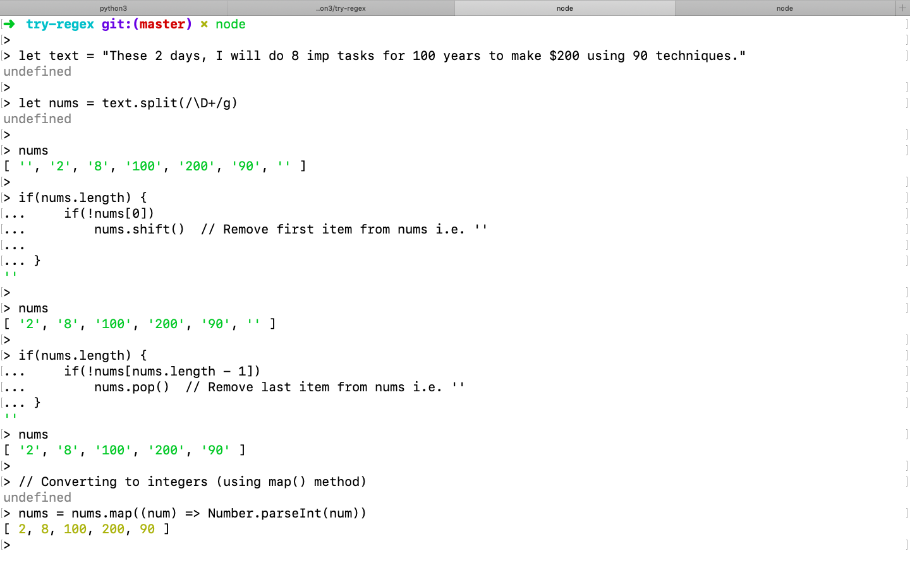

# try-regex

A repository to work on regular expressions of different programming languages(basically Python, JavaScript, Golang etc.), trying different samples as per the need based on different requirements. 

> You can also visit https://hygull.github.io/try-regex/ to see colored beautiful documentation of this same age.

## Contents

+ [Getting started - Python's regular expressions](#python-regex)

+ [Getting started - JavaScript's regular expressions](#js-regex)

<h2 id="python-regex">Getting started - Python's regular expressions</h2>

+ Open **Python3** terminal and list out all the packages of **re** module.

```bash
Python 3.6.7 (v3.6.7:6ec5cf24b7, Oct 20 2018, 03:02:14) 
[GCC 4.2.1 Compatible Apple LLVM 6.0 (clang-600.0.57)] on darwin
Type "help", "copyright", "credits" or "license" for more information.
>>>
>>> import re
>>> 
>>> dir(re)
['A', 'ASCII', 'DEBUG', 'DOTALL', 'I', 'IGNORECASE', 'L', 'LOCALE', 'M', 'MULTILINE', 'RegexFlag', 'S', 'Scanner', 'T', 'TEMPLATE', 'U', 'UNICODE', 'VERBOSE', 'X', '_MAXCACHE', '__all__', '__builtins__', '__cached__', '__doc__', '__file__', '__loader__', '__name__', '__package__', '__spec__', '__version__', '_alphanum_bytes', '_alphanum_str', '_cache', '_compile', '_compile_repl', '_expand', '_locale', '_pattern_type', '_pickle', '_subx', 'compile', 'copyreg', 'enum', 'error', 'escape', 'findall', 'finditer', 'fullmatch', 'functools', 'match', 'purge', 'search', 'split', 'sre_compile', 'sre_parse', 'sub', 'subn', 'template']
>>> 
```

+ Here we don't know which are callable and which are constants/variables. Have a look at the below error by assuming that **re.A** is a callable.

```python
>>> re.A()
Traceback (most recent call last):
  File "<stdin>", line 1, in <module>
TypeError: 'RegexFlag' object is not callable
>>> 
>>> re.A
<RegexFlag.ASCII: 256>
>>> 
```

+ Finding list of all callables.

> Here, in the below example you can see **re.A** is not a callable. 

```python
>>> for item in dir(re):
...     if callable(getattr(re, item)):
...         print(item)
... 
RegexFlag
Scanner
_compile
_compile_repl
_expand
_pattern_type
_pickle
_subx
compile
error
escape
findall
finditer
fullmatch
match
purge
search
split
sub
subn
template
>>> 
```

+ Retrieving all integers from text - Using **sub()** (replacement) function

```python
>>> import re
>>> 
>>> text = "These 2 days, I will do 8 imp tasks for 100 years to make $200 using 90 techniques."
>>> nums = re.sub(r"\D+", '', text)
>>> nums
'2810020090'
>>> 
>>> nums = re.sub(r"\D+", ' ', text)  # PERFECT
>>> nums
' 2 8 100 200 90 '
>>> 
>>> nums = nums.strip()  # REMOVE spaces around
>>> nums
'2 8 100 200 90'
>>> 
>>> nums = nums.split()
>>> nums
['2', '8', '100', '200', '90']
>>> 
>>> nums = map(int, nums)
>>> nums
<map object at 0x103a45160>
>>> 
>>> nums = list(nums)
>>> nums
[2, 8, 100, 200, 90]
>>> 
>>> sum(nums) # SUM OF INTEGERS
400
>>> 
```


<!-- Node/JavaScript PART-->
<h2 id="js-regex">Getting started - JavaScript's regular expressions</h2>

+ Retrieving all integers from text

```javascript
➜  try-regex git:(master) ✗ node                     
> 
> let text = "These 2 days, I will do 8 imp tasks for 100 years to make $200 using 90 techniques."
undefined
> 
> let nums = text.split(/\D+/g)
undefined
> 
> nums
[ '', '2', '8', '100', '200', '90', '' ]
> 
> if(nums.length) {
...     if(!nums[0]) 
...         nums.shift()  // Remove first item from nums i.e. ''  
... 
... }
''
> 
> nums
[ '2', '8', '100', '200', '90', '' ]
> 
> if(nums.length) {
...     if(!nums[nums.length - 1]) 
...         nums.pop()  // Remove last item from nums i.e. ''  
... }
''
> nums
[ '2', '8', '100', '200', '90' ]
> 
> // Converting to integers (using map() method)
undefined
> nums = nums.map((num) => Number.parseInt(num))
[ 2, 8, 100, 200, 90 ]
> 
> nums
[ 2, 8, 100, 200, 90 ]
> 
```

> Attached screenshot




## Python references

+ [https://www.tutorialspoint.com/python3/python_reg_expressions.htm](https://www.tutorialspoint.com/python3/python_reg_expressions.htm)

+ [https://docs.python.org/3/howto/regex.html](https://docs.python.org/3/howto/regex.html)

## JavaScript references

+ [https://www.w3schools.com/jsref/jsref_shift.asp](https://www.w3schools.com/jsref/jsref_shift.asp)

+ [https://www.w3schools.com/jsref/jsref_pop.asp](https://www.w3schools.com/jsref/jsref_pop.asp)

